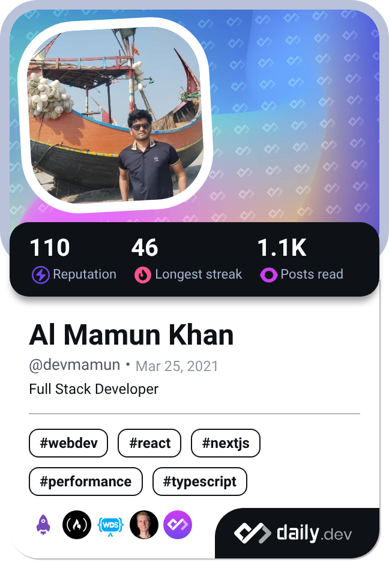

  

<h1 align="center">Welcome to My Profile! </h1>

  
  

<table align="center">
  <tr>
    <td>
      

       
      

    </td>
    <td>
      

         
        
      

    </td>
  </tr>
</table>

### 🌱 Currently Learning

- [AWS](https://aws.amazon.com/)
- [DevOps](https://www.google.com/search?q=DevOps)
- [Golang](https://go.dev)
- SWE

### 💪 Challenges I'm Taking On

- Waking up earlier to maximize productivity
- Coding at least 4 hours daily
- Exercising 3 days a week
- Enhancing my CV with additional education beyond university

## 🖥️ Operating System

## 🚀 Technologies I Know

  
  
  
  
  
  
  
  
  
  
  
  
  
  
  
  
  
  

### Other Languages

  
  
  

## 👨‍💻 Profile Overview

   <table>
   <h1 align="center">Github Stats</h1>
       <tr>
       <td></td>
       <td> </td>
     </tr>
     <tr>
        <td colspan="2" align="center"></td>
     </tr>
   </table>

## 🛠️ Software Architecture

- **Microservices**: My preferred architecture for building scalable and maintainable applications.
