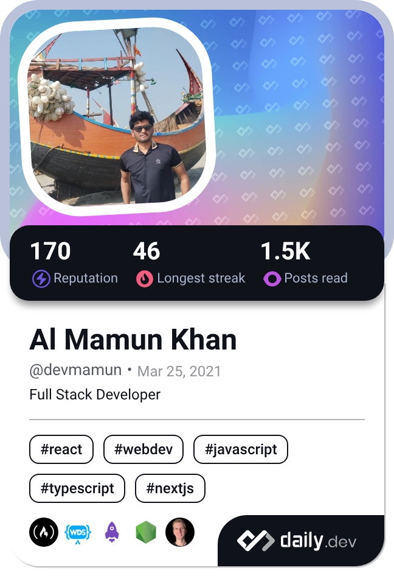

  
  
  <h1>Welcome to My Profile! </h1>

  

    
    
    
  

---

## 📊 Developer Profiles

<table align="center" width="100%" style="table-layout: fixed;">
  <tr>
    <td width="50%" align="center" style="vertical-align: middle;">
      
    </td>
    <td width="50%" align="center" style="vertical-align: middle;">
       
      
    </td>
  </tr>
</table>

---

## 📈 Projects Overview:

## 👥 Team Projects

### 🛒 B2B E-commerce Platform

**🔗 https://chinaonlinebd.com**

Chinaonlinebd.com is one of the largest wholesale marketplaces in Bangladesh, providing local and international products at wholesale prices. Users can also purchase products from Alibaba in BDT.

**Role & Contribution:**

- Full **frontend redesign** (Homepage to Dashboard)
- Implemented core **UI/UX and functionality improvements**
- Worked as part of the **ITCommerz team**

---

## 👨‍💻 Single (Full Ownership) Projects

### 🛍️ D2C/B2C E-commerce Platform

- 🔗 https://apsara.com.bd
- 🔗 https://ozybd.com
- 🔗 https://techfev.com.bd

End-to-end development including planning, architecture, and deployment.

**Key Features & Integrations:**

- 🚚 Courier API: Steadfast
- 💳 Payment Gateway: bKash, EPS
- ☁️ VPS, NGINX, Cloudflare integration
- 📩 Email system via Resend
- 🔐 Session-based authentication
- 🛡️ Fraud detection system
- 📊 SEO & Google Tag Manager (GTM)

> 🔄 Ongoing improvements and feature updates

### 📖 Library Management System (Bangla Department)

**🔗 https://bangla.rub.ac.bd**

A full digital + physical library management system designed for restricted academic access.

**Core Features:**

- 🔐 **Secure Access** (Invite-only registration)
- 📚 **E-Book System** (View & download)
- 📝 **Membership Application with QR verification**
- 🔍 **QR Code Verification System**
- 🧾 **Book Borrowing System**
  - Max 2 books
  - 7-day return policy
  - 1-time renewal (2 days)
  - Automated fine (5 BDT/day)
- 📩 **Automated Notifications**
  - Due reminders & overdue alerts
- 📄 **PDF Reports for overdue users**
- 📈 **Popular Books Tracking**

---

## 📈 GitHub Activity Overview

---

## 🌱 Currently Learning

- **[AWS](https://aws.amazon.com/)** - Cloud Computing & Services
- **[DevOps](https://www.google.com/search?q=DevOps)** - CI/CD & Infrastructure
- **[Golang](https://go.dev)** - Backend Development
- **Software Engineering** - Best Practices & Design Patterns

---

## 💪 Personal Goals & Challenges

- ⏰ Waking up earlier to maximize productivity
- 💻 Coding at least 4 hours daily
- 🏋️ Exercising 3 days a week
- 📚 Enhancing my CV with continuous learning beyond university

---

### 🛠️ Tech Stack:

- Frontend: **ReactJS**, **Next.js**, **Typescript**, **Shadcn UI**, **JavaScript**, **Redux**, **Zod**, **Axios.**
- Backend: **Node.js**, **Express**, **Postgresql**, **Prisma**, **MongoDB**, **Mongoose**
- Familiar: **Docker**, **AWS (EC2/S3)**, **PM2**, **C/C++**, **PHP**, **Golang**
- Deployment: **Vercel**, **Railway**, **VPS**
- Tools: **Git**, **GitHub**, **Postman**, **Jira**, **tmux**, **Vim**, **Supabase**, **Neon**

---

## 🏗️ Software Architecture

**Microservices** - My preferred architecture for building scalable, maintainable, and robust applications

---

## 📊 GitHub Statistics

<table align="center" width="100%" style="table-layout: fixed;">
  <tr>
    <td width="50%" align="center" style="vertical-align: middle;">
      
    </td>
    <td width="50%" align="center" style="vertical-align: middle;">
      
    </td>
  </tr>
  <tr>
    <td colspan="2" align="center" style="padding-top: 10px;">
      
    </td>
  </tr>
</table>

---

  

---

  
  **💼 Open to collaborations and opportunities**
  
  ⭐ **Feel free to explore my repositories and connect!**
  

