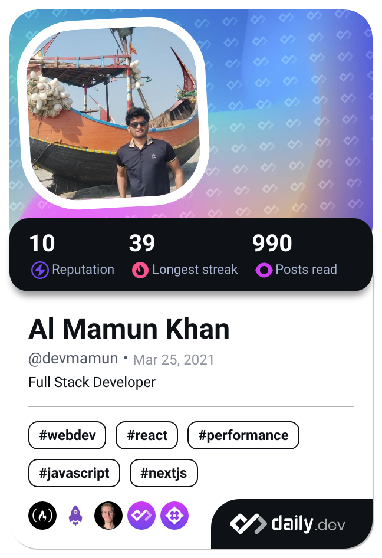

  
  
  <h1>Welcome to My Profile! </h1>

  

    
    
    
  

---

## 📊 Developer Profiles

<table align="center" width="100%" style="table-layout: fixed;">
  <tr>
    <td width="50%" align="center" style="vertical-align: middle;">
      
    </td>
    <td width="50%" align="center" style="vertical-align: middle;">
       
      
    </td>
  </tr>
</table>

---

## 📈 GitHub Activity Overview

---

## 🌱 Currently Learning

- **[AWS](https://aws.amazon.com/)** - Cloud Computing & Services
- **[DevOps](https://www.google.com/search?q=DevOps)** - CI/CD & Infrastructure
- **[Golang](https://go.dev)** - Backend Development
- **Software Engineering** - Best Practices & Design Patterns

---

## 💪 Personal Goals & Challenges

- ⏰ Waking up earlier to maximize productivity
- 💻 Coding at least 4 hours daily
- 🏋️ Exercising 3 days a week
- 📚 Enhancing my CV with continuous learning beyond university

---

## 🖥️ My Default Operating System

---

### 🛠️ Tech Stack:

- Frontend: **ReactJS**, **Next.js**, **Typescript**, **Shadcn UI**, **JavaScript**, **Redux**, **Zod**, **Axios.**
- Backend: **Node.js**, **Express**, **Postgresql**, **Prisma**, **MongoDB**, **Mongoose**
- Familiar: **Docker**, **AWS (EC2/S3)**, **PM2**, **C/C++**, **PHP**, **Golang**
- Deployment: **Vercel**, **Railway**, **VPS**
- Tools: **Git**, **GitHub**, **Postman**, **Jira**, **tmux**, **Vim**, **Supabase**, **Neon**

### Frontend Development

  
  
  
  
  
  
  

**Libraries & Tools:** Shadcn UI, Zod, Axios

### Backend Development

  
  
  
  
  
  

**ORM & Tools:** Mongoose, Prisma

### DevOps & Cloud

  
  
  

**Services:** EC2, S3, VPS, Vercel, Railway

### Development Tools

  
  
  
  
  

**Others:** Jira, tmux, PM2, Supabase, Neon

### Other Programming Languages

  
  
  

---

## 🏗️ Software Architecture

**Microservices** - My preferred architecture for building scalable, maintainable, and robust applications

---

## 📊 GitHub Statistics

<table align="center" width="100%" style="table-layout: fixed;">
  <tr>
    <td width="50%" align="center" style="vertical-align: middle;">
      
    </td>
    <td width="50%" align="center" style="vertical-align: middle;">
      
    </td>
  </tr>
  <tr>
    <td colspan="2" align="center" style="padding-top: 10px;">
      
    </td>
  </tr>
</table>

---

  

---

  
  **💼 Open to collaborations and opportunities**
  
  ⭐ **Feel free to explore my repositories and connect!**
  

